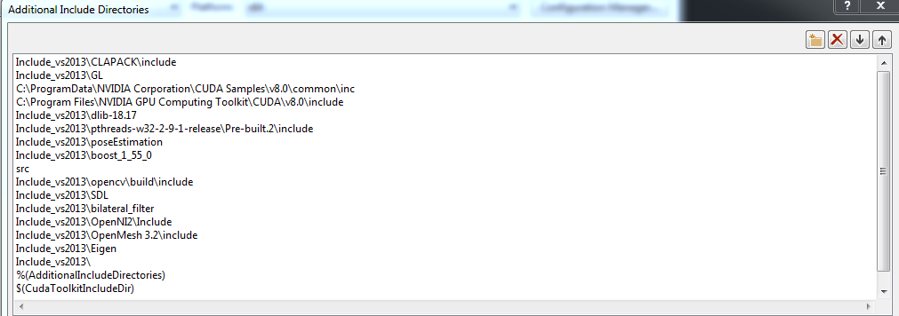
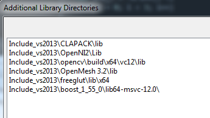
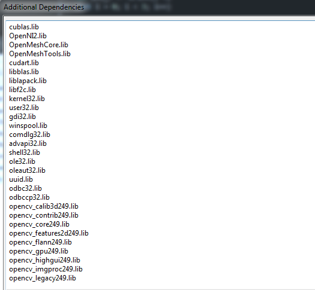

# irisfaceRGBD

This file is part of the "USC IRIS 3D face modeling and recognition software" <br />
developed at the University of Southern California by USC IRIS. <br />
Copyright (c) 2017 fasf of Southern California.  All Rights Reserved. <br />


# 3D Face Recogntion
Kim, Donghyun, et al. "Deep 3D Face Identification." arXiv preprint arXiv:1703.10714 (2017). <br />
## This is a 3D face recognition software. 

Dependencies: python 2, caffe (http://caffe.berkeleyvision.org/), numpy, scipy, sklearn <br />
Pre-trained Weight (https://drive.google.com/file/d/0B47nI8lp4t_CTUVxc3Y4b29VR2c/view?usp=sharing) <br />
Input: 3D face of point clouds (.ply format) in Probe and Gallery folder  <br />
Output: Similarities between probe and gallery 


### Step 1. Convert a 3D point cloud (.ply) into 2D depth map (.npy)

Run follwoing command to generate a 2D depth map in ./3DFace/Probe and ./3DFace/Gallery folder
```
python Preprocessing.py
```

### Step 2. Measure similarities between probe and gallery set

Run follwoing command to calculate similarities
```
python Recognition.py
```


# 3D Face Modeling

## This is a 3D face modeling software.
Description <br />
This Window library supports 3D face modeling with the PrimeSense or Kinect 1.0 camera. It supports functions of face modeling. 
There are two supporting versions: (1) Visual Studio 2013 and (2) 2015 Solutions (x64 Release)

Assumptions <br />
The program is for a single user at a time. The person should not stand farther than 1 meter away from the camera or closer than 40 cm to the camera. This version requires "frontal faces" as first input for face modeling, and it can cover pose changes.

Input: RGB-D frame from a low-cost depth sensor (e.g. Kinnect or PrimeSense)
Output: 3D face model (~/model/mymodel.ply)

## Structure
This package includes 4 main folders:
1.	IRIS3DFacemodeling_cuda8.0\Include_vs2013 or Include_vs2015: 3rd party libraries in Include folder. (e.g) dlib, openCV, OpenMesh 3.2, OpenNI2, pose estimation, pthreads-w23-2-9-1, boost 1.55.0, CUDA 8.0
2. IRIS3DFacemodeling_cuda8.0\dll_vs2013 or dll_vs2015: 3rd party dll files
3. IRIS3DFacemodeling_cuda8.0\src: Face modeling source code.
4. IRIS3DFacemodeling_cuda8.0\model: Face modeling results of OBJ and PLY format.
5. IRIS3DFacemodeling_cuda8.0\Release: Executable file of the project.

## 3rd party libraries

Visual Studio 2013, CUDA8.0, OpenCV 2.4.9, dlib 18.17, pthreads 2.9.1, boost 1.55, OpenMesh 3.2 </br>
Visual Studio 2015, CUDA8.0, OpenCV 2.4.9, dlib 18.17, pthreads 2.9.1, boost 1.59, OpenMesh 4.1

### Configuration of the project properties
1.	Go to Configuration Properties → C/C++ → General → Additional Include Directories. Include additional include directories, as shown below:
---
<p align="center">
  
</p>

2.  Go to Configuration Properties → Linker → General → Additional Library Directories. Include additional library directories, as shown below: 
<p align="center">
  
</p>

3. 	Go to Configuration Properties → Linker → Input → Additional Dependencies, as shown below: 
<p align="center">
  
</p>

## How to use

After starting, the program will display the RGB frames in real time & detected face bounding box. This program also will display a modeled face in real time. Here are your options for other processes: <br />
•	Press key 'r' to reset a face modeling and start to make a new face modeling. The assumption of the program is that the first frame should be a frontal face. You can adequately choose a first frame which is a frontal face by resetting. <br />
•	Press key 'd' to switch between the depth and the RGB display. <br />
•	Press key 'q/ESC' to exit the program and produce the modeled face as OBJ and PLY file. The default output file is ./model/mymodel.obj, ./model/mymodel.ply <br />
To visualize your output, open it with MeshLab http://meshlab.sourceforge.net/

## Demo

1. Download the sample RGB-D video (https://drive.google.com/file/d/0B47nI8lp4t_CTm0zUjg1S3RXeW8/view?usp=sharing), and place the file in ~/IRIS3DFacemodeling_cuda8.0
2. Set command arguments as the name of the video file. 
<p align="center">
  
</p>
3. Run the program.
 - modeling process
<p align="center">
  
</p>
 - modeling result
<p align="center">
  
</p>
