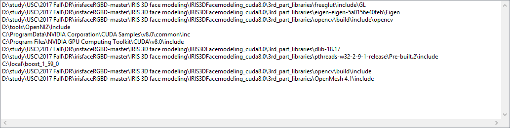
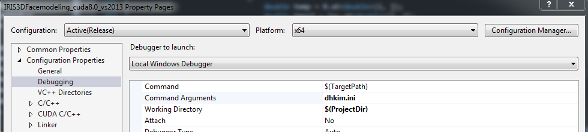
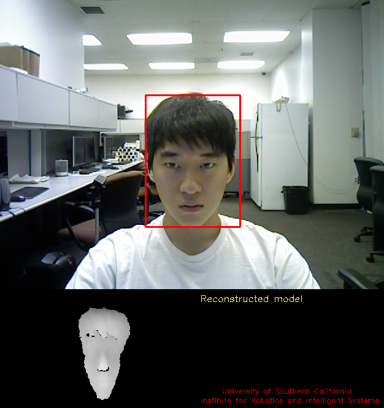
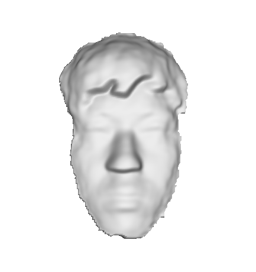

# irisfaceRGBD
This file is part of the "USC IRIS 3D face modeling and recognition software" <br />
developed at the University of Southern California. <br />
Copyright (c) 2017 University of Southern California.  All Rights Reserved. <br />

# 3D Face Modeling

## This is a 3D face modeling software.
Description <br />
This Window library supports 3D face modeling with the PrimeSense or Kinect 1.0 camera. It supports functions of face modeling. 
There are two supporting versions: (1) Visual Studio 2013 and (2) 2015 Solutions (x64 Release)

Assumptions <br />
The program is for a single user at a time. The person should not stand farther than 1 meter away from the camera or closer than 40 cm to the camera. This version requires "frontal faces" as first input for face modeling, and it can cover pose changes.

Input: RGB-D frame from a low-cost depth sensor (e.g. Kinnect or PrimeSense)
Output: 3D face model (~/model/mymodel.ply)

## Structure
This package includes 3 main folders:
1. IRIS 3D face modeling\IRIS3DFacemodeling_cuda8.0\src: Face modeling source code.
2. IRIS 3D face modeling\IRIS3DFacemodeling_cuda8.0\model: Face modeling results of OBJ and PLY format.
3. IRIS 3D face modeling\x64\Release: Executable file of the project.

## 3rd party libraries

Visual Studio 2013, CUDA8.0, OpenNI2, OpenCV 2.4.9, dlib 18.17, pthreads 2.9.1, boost 1.55, OpenMesh 3.2, CLAPACK, freeglut, Eigen </br>
Visual Studio 2015, CUDA8.0, OpenNI2, OpenCV 2.4.9, dlib 18.17, pthreads 2.9.1, boost 1.59, OpenMesh 4.1, CLAPACK, freeglut, Eigen

## How to build

1. Download the ZIP file of the whole package and extract.
2. Download all the 3rd party libraries. It's recommanded that you extract/install all the 3rd party libraries into one folder except for CUDA 8(you may use it a lot for other projects), and boost library(change path can cause installation errors).<br />
CUDA Toolkit 8.0: https://developer.nvidia.com/cuda-80-ga2-download-archive<br />
Select your platform and follow the step-by-step instruction to install it.<br /><br />
OpenNI2: https://structure.io/openni<br />
For me, I downloaded OpenNI 2.2.0.33 Beta (x64) under Windows section.<br /><br />
Openmesh: https://www.openmesh.org/download/ <br />
Download Openmesh 4.1 if you are using VS2015, 3.2 is you are using VS2013. For me I downloaded 4.1(static) under VS2015 column<br />
OpenCV 2.4.9: https://sourceforge.net/projects/opencvlibrary/files/opencv-win/2.4.9/opencv-2.4.9.exe/download <br /><br />
dlib 18.17: https://sourceforge.net/projects/dclib/files/dlib/v18.17/dlib-18.17.zip/download <br /><br />
pthreads 2.9.1: ftp://sourceware.org/pub/pthreads-win32 <br />
find pthreads-w32-2-9-1-release.zip, downloaded and unzip it.<br /><br />
boost: https://sourceforge.net/projects/boost/files/boost-binaries/1.59.0/ <br />
Choose the one that fit your machine. For me, I download boost_1_59_0-msvc-14.0-64.exe since I am using VS2015 on 64 bit computer.<br />
Installing boost in the default path (usually in C:\local\boost_1_59_0) is recommanded since change path can create installing errors.<br /><br />
CLAPACK:http://icl.cs.utk.edu/lapack-for-windows/lapack/<br />
This is a tricky one. For this project, you only need to downloaded some specific rebuilt lib files and dll files.<br />
In LAPACK page, under Prebuilt dynamic libraries using Mingw section, download the dll and lib files of Ref BLAS and LAPACK. For me, I downloaded x64_dll and x64_lib of both Ref BLAS and LAPACK.<br />
In CLAPACK page, under Prebuilt libraries section, doanload libf2c.lib.<br />
You will have 5 files in total, liblapack.lib, libblas.lib, libblas.dll, liblapack.dll and libf2c.lib. You can manually create a folder named 'CLAPACK' and put all the 5 files into it.<br /><br />
Eigen: http://eigen.tuxfamily.org/index.php?title=Main_Page<br />
Download the latest released zip verison and unzip it.<br /><br />
Freeglut: http://www.transmissionzero.co.uk/software/freeglut-devel/<br />
Click on Download freeglut 3.0.0 for MSVC under freeglut 3.0.0 MSVC Package section.


3. Open the solution file(.sln) of the project in irisfaceRGBD-master\IRIS 3D face modeling. There are two solution files, you only need the one which fits in the version of your Visual Studio. <br />

4. Set the solution configurations and platforms as Release x64. Go to Project → Properties (or right click on 'IRIS3DFacemodeling_cuda8.0_vs2015' in the solution explorer, then click on Properties), make sure the active configuration and platform is Release and X64.

5. To add 3rd party libraries into the project, there are three project properties needed to be configurated. <br /><br />
Go to Configuration Properties → C/C++ → General → Additional Include Directories. Include additional include directories. They are usually the 'include' folders under the libraries main folders. When you get errors like 'XXX.h not found' when building the project, it basically means you did not include the directory of this header(.h) file.
The screen shot below shows how the Additional Include Directories should look like. However the path before the libraries' name can differ from each user depending on where the libraries are extracted/installed.
<p align="center">
  
</p>

Go to Configuration Properties → Linker → General → Additional Library Directories. Include additional library directories.
These directories include all the .lib files of all the libraries, as shown below. Same as the cinlude directories, the path before the libraries' name can differ from each user depending on where the libraries are extracted/installed.
<p align="center">
  
</p> 

Go to Configuration Properties → Linker → Input → Additional Dependencies. We have already added all the lib files names. Usually you do not need to change anything here. But in case Additional Dependencies is somehow empty in your machinem, You can just copy the .lib files' names below to Additional Dependencies:<br /><br />
cublas.lib <br />
OpenNI2.lib <br />
OpenMeshCore.lib <br />
OpenMeshTools.lib <br />
cudart.lib <br />
libblas.lib <br />
liblapack.lib <br />
libf2c.lib <br />
kernel32.lib <br />
user32.lib <br />
gdi32.lib <br />
winspool.lib <br />
comdlg32.lib <br />
advapi32.lib <br />
shell32.lib <br />
ole32.lib <br />
oleaut32.lib <br />
uuid.lib <br />
odbc32.lib <br />
odbccp32.lib <br />
opencv_calib3d249.lib <br />
opencv_contrib249.lib <br />
opencv_core249.lib <br />
opencv_features2d249.lib <br />
opencv_flann249.lib <br />
opencv_gpu249.lib <br />
opencv_highgui249.lib <br />
opencv_imgproc249.lib <br />
opencv_legacy249.lib <br />
opencv_ml249.lib <br />
opencv_nonfree249.lib <br />
opencv_objdetect249.lib <br />
opencv_ocl249.lib <br />
opencv_photo249.lib <br />
opencv_stitching249.lib <br />
opencv_superres249.lib <br />
opencv_ts249.lib <br />
opencv_video249.lib <br />
opencv_videostab249.lib <br />

6. Click on Build → Build Solution. If the solution is built successfully, the .exe file of this project will be in irisfaceRGBD-master\IRIS 3D face modeling\x64\Release.

## How to Run

You need to copy some dll files to irisfaceRGBD-master\IRIS 3D face modeling\x64\Release(same path with the exe file) folder before you can run the exe file successfuly. The steps of finding all the dll files for x64, VS2015 is listed below. The steps of getting these dll files for x32 and VC2013 are similar to the steps below.<br /><br />
Go to where you installed your OpenCV package. Go to opencv\build\x64\vc12\bin, copy opencv_calib3d249.dll, opencv_core249.dll, opencv_features2d249.dll, opencv_flann249.dll, opencv_highgui249.dll, opencv_imgproc249.dll.<br /><br />
Go to where you installed OpenNI2. Go to OpenNI2\Tools, copy OpenNI2.dll and the whole OpenNI2 folder.<br /><br />
Go to where you put all the CLAPACK files. You should have already downloaded libblas.dll and liblapack.dll. Just copy both of them.<br /><br />
Go to where you installed freeglut. Go to freeglut\bin\x64 and copy freeglut.dll.<br /><br />


## Troubleshooting
1. You may get this error when loading the project: XXX\irisfaceRGBD-master\IRIS 3D face modeling\IRIS3DFacemodeling_cuda8.0\IRIS3DFacemodeling_cuda8.0_vs2015.vcxproj(55,5): The imported project "XXX\MSBuild\Microsoft.Cpp\v4.0\V140\BuildCustomizations\CUDA 8.0.props" was not found. Confirm that the path in the <Import> declaration is correct, and that the file exists on disk. <br />
In this case, firstly make sure you have installed CUDA 8.0 successfully, then find the CUDA 8.0.pros file. The path of this file depends on where you installed CUDA 8.0. It is generally in C:\Program Files\NVIDIA GPU Computing Toolkit\CUDA\v8.0\extras\visual_studio_integration\MSBuildExtensions.
Copy all the 4 files to the BuildCustomizations folder where the error told you the CODA 8.0.props was not found. Reload the project.

2. If you get errors in pthread, then make this change in pthread.h:
<p align="center">
  
</p> 

3. Some OpenMesh errors occur when you are using Visual Studio 2015 SP3. If you are suing VS2015 SP3 and see the error: OpenMesh/Core/Mesh/PolyConnectivity.hh(86): error C2440: 'specialization': cannot convert from 'overloaded-function' to 'bool (__cdecl OpenMesh::ArrayKernel::* )(void) const' (compiling source file DataMeshItemCurvedPipe.cpp), you need to modify the error lines following: https://mailman.rwth-aachen.de/pipermail/openmesh/2016-June/001234.html

4. Some other OpenMesh errors occur in some very machines. We have not found a good way to directly fix them, you may need to Cmake your OpenMesh package before using it.

5. In the file IRIS3DFacemodeling_cuda8.0_vs2015.vcxproj\IRIS3DFacemodeling_cuda8.0_vs2015.vcxproj, line 200, the path of source.cpp is set as where it is in our computer. If you extracted dlib library into different folders, you may get error. To correct it, find the sourse.cpp file in your dlib library, and replace the original path in IRIS3DFacemodeling_cuda8.0_vs2015.vcxproj line 200 with where you find your source.cpp.

6. If the warning 'Not enough USB controller resources' shows up, go to irisfaceRGBD-master\IRIS 3D face modeling\x64\Release\OpenNI2\Drivers, open PS1080.ini, go to line 28, uncomment this line (delete the semicolon) and change the UsbInterface value to 0.

## How to use

After starting, the program will display the RGB frames in real time & detected face bounding box. This program also will display a modeled face in real time. Here are your options for other processes: <br />
•	Press key 'r' to reset a face modeling and start to make a new face modeling. The assumption of the program is that the first frame should be a frontal face. You can adequately choose a first frame which is a frontal face by resetting. <br />
•	Press key 'd' to switch between the depth and the RGB display. <br />
•	Press key 'q/ESC' to exit the program and produce the modeled face as OBJ and PLY file. The default output file is ./model/mymodel.obj, ./model/mymodel.ply <br />
To visualize your output, open it with MeshLab http://meshlab.sourceforge.net/

## Demo

1. Download the sample RGB-D video (https://drive.google.com/file/d/0B47nI8lp4t_CTm0zUjg1S3RXeW8/view?usp=sharing), and place the file in ~/IRIS3DFacemodeling_cuda8.0
2. Set command arguments as the name of the video file. 
<p align="center">
  
</p>
3. Run the program.
 - modeling process
<p align="center">
  
</p>
 - modeling result
<p align="center">
  
</p>

# 3D Face Recogntion
Kim, D., Hernandez, M., Choi, J. and Medioni, G., 2017. Deep 3D Face Identification. arXiv preprint arXiv:1703.10714. <br />

## This is a 3D face recognition software. 

Dependencies: python 2, caffe (http://caffe.berkeleyvision.org/), numpy, scipy, sklearn <br />
Pre-trained Weight (https://drive.google.com/file/d/0B47nI8lp4t_CTUVxc3Y4b29VR2c/view?usp=sharing) <br />
Input: 3D face of point clouds (.ply format) in Probe and Gallery folder  <br />
Output: Similarities between probe and gallery 

## Preparation
To make the recognition part work with modeling part better, we recommend you do it on Windows. The instruction of how to run it on Ubuntu is also provided for special purposes.

### Windows
#### Install Anaconda
Firstly, please download and install Anaconda distribution at: https://www.anaconda.com/download/#macos as most of dependencies will be automatically installed. Anaconda tools are also handy if you want to do python projects in the future. In this project, we are using python 2.7 version.

#### Install Plyfile
We are using pip to install the dependency plyfile. Open Anaconda Prompt (click on the windows icon on the left bottom of your screen and type anaconda prompt, it should then appear if you have installed Anaconda successfully). Input:
```
python -m pip install --upgrade pip
```
You will either see the updating process of pip or a line:
```
‘Requirement already up-to-date’.
```
Then, just input:
```
‘pip install plyfile’ 
```
The plyfile dependency will be installed into your python.

#### Install Caffe
Then we are going to install Caffe. Go to: http://caffe.berkeleyvision.org/
Under Documentation section, click on installation instruction. Then click on Windows under step-by-step instructions. You will be navigated to the github repository of Windows Caffe. Download the whole repository. Copy the ‘python’ folder of Caffe to the ‘site-packages’ folder of Anaconda. Assuming you installed both Anaconda and Caffe in C disk then you need to copy the Caffe folder under C:\caffe\python to C:\Anaconda\Lib\site-packages.

#### Download pre-trained weight
Download the pre-trained weight from:
https://drive.google.com/file/d/0B47nI8lp4t_CTUVxc3Y4b29VR2c/view
Then copy the Weights.caffemodel file to your IRIS 3D face recognition folder. 

### Ubuntu

## How to Run
For easily debugging, you can firstly open the py files in spyder. Spyder is a Matlab-like anaconda tool which can track the values of vaiables easily. 
### Step 1. Convert a 3D point cloud (.ply) into 2D depth map (.npy)

Run Preprocessing.py to generate a 2D depth map in ./3DFace/Probe and ./3DFace/Gallery folder

### Step 2. Measure similarities between probe and gallery set

Run Recognition.py to calculate similarities

## Troubleshooting

1. Error 'No module named google.protobuf.internal'  when trying to run Recognition.py.
Solution: pip install protobuf

2. 'IndexError: only integers, slices (`:`), ellipsis (`...`), numpy.newaxis (`None`) and' when running Preprocessing.py.
Solution: change XYProjection.py line 43 from:
im0 = aInd
to:
im0 = int(aInd)
